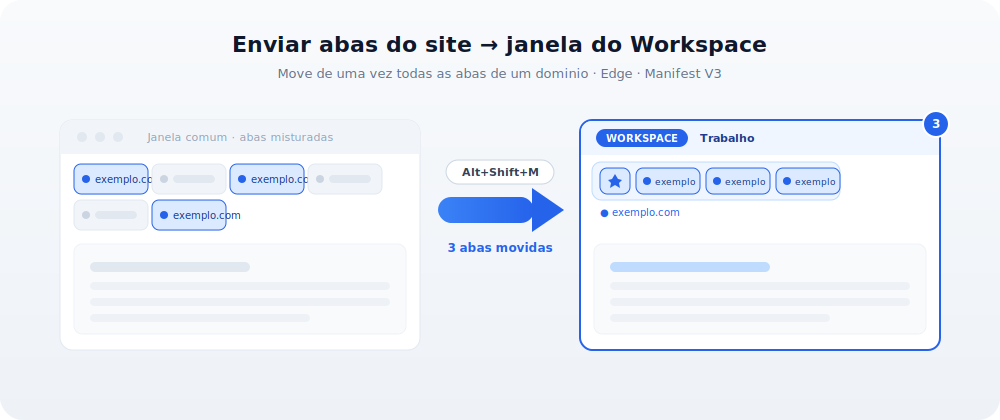

# Enviar abas do site para o Workspace (Edge)

[](LICENSE)


Extensão para Microsoft Edge (Manifest V3) que move de uma vez **todas as abas de um domínio**
para a **janela de um Workspace** — por botão no popup ou por atalho de teclado.

<p align="center">
  
</p>

## Por que "janela" e não "Workspace por nome"?

O Edge Workspaces **não expõe API** (nem `chrome.tabs`/`chrome.tabGroups`, nem o DevTools
Protocol). Não dá pra endereçar um Workspace pelo nome via código. Mas um Workspace aberto é
uma **janela comum** para a API — então a extensão move as abas para essa janela. O Edge
persiste o estado do Workspace a partir das abas da janela dele.

## Recursos

- Move todas as abas de um **host exato**, **host + subdomínios** ou **padrão custom** (`*.exemplo.com`).
- **Seletor visual** da janela de destino (o Workspace aberto), com preview da contagem.
- **Atalho de teclado** (`Alt+Shift+M`) que repete a ação na última janela salva.
- Abas **fixadas** preservadas; **badge** no ícone mostra quantas foram movidas.
- Sem acesso à rede, sem content scripts, **zero dependências**.

## Instalação (modo desenvolvedor)

1. Abra `edge://extensions`.
2. Ative **Modo de desenvolvedor** (canto inferior esquerdo).
3. Clique em **Carregar sem pacote** e selecione a pasta `edge-send-to-workspace`.

## Uso

1. Abra o **Workspace** de destino (ele abre em janela própria).
2. Em qualquer janela, abra uma aba do site que quer mover e clique no ícone da extensão.
3. Escolha **o que mover** (host exato / host + subdomínios / padrão custom) e a **janela de destino**.
4. Clique em **Mover abas**.

A escolha fica salva, então o atalho **`Alt+Shift+M`** repete: pega o domínio da aba ativa e
manda para a última janela de destino. Configure/troque o atalho em `edge://extensions/shortcuts`.

## Estrutura do projeto

```
edge-send-to-workspace/
├─ manifest.json   # MV3: permissões, action, background, command
├─ background.js   # matching por domínio + move (chrome.tabs.move) + handler do atalho
├─ popup.html      # UI do popup
├─ popup.js        # lógica do popup (seleção de janela, preview, persistência)
├─ icons/          # 16 / 32 / 48 / 128
├─ assets/         # ilustração do README (illustration.svg)
├─ README.md
├─ CHANGELOG.md
└─ LICENSE
```

## Desenvolvimento

Sem build step — é JS/HTML puro. Edite e clique em **Recarregar** em `edge://extensions`.

Sanity de sintaxe:

```bash
node --check background.js && node --check popup.js
```

## Empacotar para distribuição / store

Inclua apenas os arquivos carregáveis (sem README/LICENSE/CHANGELOG):

```bash
zip -r edge-send-to-workspace.zip manifest.json background.js popup.html popup.js icons
```

## Importante: valide a persistência do Workspace (1x)

O sync do Workspace é do lado do Edge. Na primeira vez:

1. Mova algumas abas para a janela do Workspace com a extensão.
2. Feche e reabra o Workspace.
3. Confirme que as abas voltaram. Em builds recentes funciona porque o Workspace rastreia as
   abas da sua janela. Se na sua versão não persistir, o fallback robusto é **Tab Groups**, que
   tem API nativa (`chrome.tabs.group` / `chrome.tabGroups`) e é 100% confiável.

## Permissões

- `tabs` — ler URL/título das abas (filtrar por domínio) e movê-las.
- `storage` — lembrar modo, padrão custom e janela de destino para o atalho.

Sem host permissions, sem rede, sem content scripts.

## Limitações conhecidas

- A janela de destino é identificada por **ID**, que muda quando o Workspace é fechado/reaberto.
  Se isso acontecer, a extensão avisa e basta reabrir o Workspace e reselecionar na lista.
- Abas fixadas são movidas para a região fixada da janela de destino.
- Não há como, via API, abrir um Workspace pelo nome; por isso você o abre antes.

## Contribuindo

Issues e PRs são bem-vindos. Mantenha o escopo mínimo e **sem dependências externas**.

## Licença

[MIT](LICENSE) © 2026 Edson Dias.
